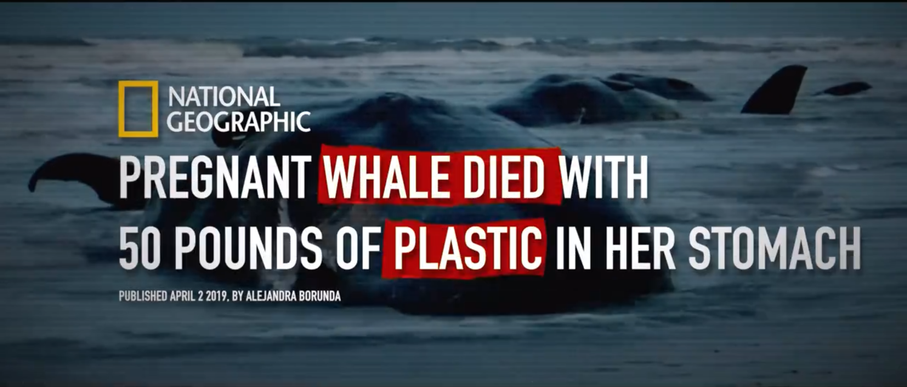
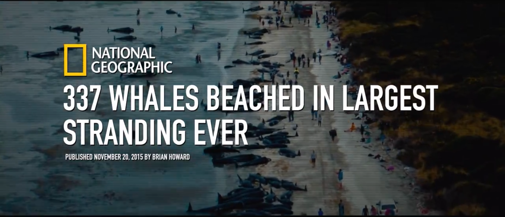

**Seaspiracy** merupakan film dokumenter yang menyelamai kehanjuran ekosistem
laut yang disebabkan oleh industri perikanan global serta perannya dalam memicu
polusi plastik.

 

**Seaspiracy** adalah karya para produser di balik film dokumenter **Cowspiracy
2014** yang memenangkan sejumlah pengharagaan, Ali Tabrizi.

Ali mencerikan bahwa ia telah terpesona dengan lautan dan kehidupan didalamnya.

Berangkat dari kencitaannya tersebut,Ali membuat dokumneter yang menunjukan
prilaku buruk manusia-manusia yang mencelakai spesies laut dan mengungkap
korupsi global yang mengkhawatirkan.

 

**Seaspiracy**
--------------

Saat kapal ada ditengan lautan jika terjadi masalah, kami bisa dilempar ke laut.

Membuat film dokumenter ini sangatlah berbahaya. Ada banyak resikonya.

Jika taku mati, pulanglah.

 

Ali menceritakan sejak kecil, dia terpikat oleh lumba-lumba dan paus.Obsesinya
pada lautan dikarenakan menonton film dokumenter dari orang-orang seperti
**Jacques Cousteau, David Atterborough, dan Sylvia Earle.**

Menonton film meraka mentingkapkan dunia baru bagi Ali,yang dipenuhi keindahan
yang melimpah,warna, dan kehidupan. Ali bermimpi kelak bisa menjelajahi lautan
kita yang kaya seperti mereka. Mengambil gambar semua satwa liar yang
menakjubkan yang hidup dibawah ombak. Setelah lulus kuliah, Ali mengerjakan film
dokumenter lain, tetapi pada usia 22, siap membuat film sendiri tentang betapa
menkjubkannya lautan.

Lautan adalah rumah bagi 80% kehidupan di bumi dengan sebagian besar lautan
belum dijelajahi hingga kini, bagi saya, lautan adalah sumber inspirasi yang
tidak bisa dirusak. Namun, tak lama setelah memulai proyek ini,visi indah saya
selama ini akan lautan berubah total.

Paus yang Hamil Meninggal dengan 50 Punds Plastik diperutnya

Bayi Lumba-lumba ditemukan Meniggal dengan Perut penuh sampah plastik.

Tren yang mengkhawatirkan tentang paus terdampar yang dipenuhi dengan plastik

337 paus terdampar di terbesar yang pernah ada

 

Saat berita paus terdamapr mulai santer terdengan,

di sepanjang paintai tenggara Inggris tempat tinggal Ali, dia dipaksa menghadapi
sisi kisah yang tak pernah dia tahu. Kisah tentang betapa besar dampak kita
terhadap laut.

Terdamparnya hewan-hewan ini dengan perut penuh plastik sangatlah memprihatinkan
bukan karena kecerdasan luar biasa mereka, tetapi karena mereka bahkan membantu
menjaga kelangsungan hidup lautan.

Your browser does not support the audio element.
