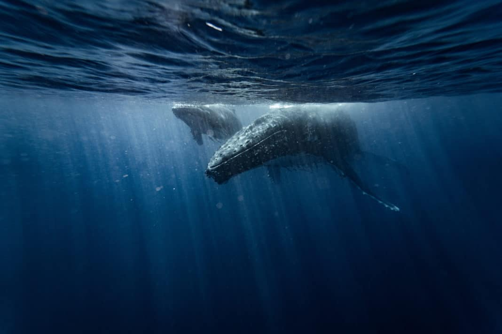

Berikut adalah beberapa dokumenter lain yang akan membuka mata kamu untuk
masalah yang terjadi di dunia sekarang. Seaspiracy adalah salah satu yang banyak
dibicarakan sekarang - berikut 7 dokumenter yang menantang kesalahpahaman umum
tentang lautan kita dan penduduknya

 

David Attenborough: A Life on Our Planet
----------------------------------------

\<iframe width="560" height="315"
src="https://www.youtube.com/embed/64R2MYUt394" title="YouTube video player"
frameborder="0" allow="accelerometer; autoplay; clipboard-write;
encrypted-media; gyroscope; picture-in-picture" allowfullscreen\>\</iframe\>

 

Dengan kecerdasan dan kehangatan yang khas, Sir David Attenborough kembali dalam
pekerjaan penting ini yang ia gambarkan sebagai "pernyataan saksi"-nya. Serial
ini menjalin melalui banyak aspek dalam kariernya yang luas mengamati upaya
konservasi alam di seluruh dunia. Akibatnya, Anda akan dapat melihat berapa
banyak yang telah hilang karena kerusakan yang ditimbulkan manusia di planet
kita ketika dilihat melalui mata satu orang yang sangat peduli tentang
kesuksesan masa depannya! Film dokumenter ini berbagi prediksi yang
mengkhawatirkan untuk masa depan planet ini jika manusia menolak untuk mengubah
perilaku mereka, tetapi juga menawarkan solusi yang menginspirasi dan mendesak
untuk menyelamatkan masa depan kita.

 

**Cara Menonton:** Anda dapat menontonnya
di [Netflix.](https://www.netflix.com/title/80216393)

Our Planet
----------

\<iframe width="560" height="315"
src="https://www.youtube.com/embed/aETNYyrqNYE" title="YouTube video player"
frameborder="0" allow="accelerometer; autoplay; clipboard-write;
encrypted-media; gyroscope; picture-in-picture" allowfullscreen\>\</iframe\>

 

Serial docu pemenang penghargaan Emmy ini adalah serial pertama Netflix yang
masuk ke dalam pemrograman alam. Difilmkan oleh lebih dari 600 anggota kru
selama empat tahun di 50 negara itu telah diriwayatkan oleh tidak lain dari Sir
David Attenborough. Perbedaan kali ini, bagaimanapun, Planet Kita tidak
menghindar dari ancaman yang dihadapi flora dan fauna yang digambarkannya tetapi
sebaliknya memilih untuk menyinari apa yang dikatakan beberapa orang adalah
keadaan darurat iklim yang akan datang.

 

**Cara Menonton:** Anda dapat menontonnya
di [Netflix.](https://www.netflix.com/title/80049832)

 

Blackfish
---------

\<iframe width="560" height="315"
src="https://www.youtube.com/embed/fLOeH-Oq_1Y" title="YouTube video player"
frameborder="0" allow="accelerometer; autoplay; clipboard-write;
encrypted-media; gyroscope; picture-in-picture" allowfullscreen\>\</iframe\>

 

Blackfish adalah salah satu film dokumenter yang paling kontroversial dan
dibicarakan hingga saat ini. Film dokumenter ini secara harfiah memang mengubah
seluruh budaya, tidak hanya di Amerika tetapi di seluruh dunia juga. Ini adalah
tampilan penting pada paus pembunuh Tilikum, yang menghabiskan hidupnya tampil
untuk SeaWorld Orlando sebelum ditutup karena kedekatannya dengan hewan lain
yang mengakibatkan beberapa kematian.

**Cara Menonton:** Anda dapat menontonnya
di [Netflix.](https://www.netflix.com/title/70267802)

 

Chasing Coral
-------------

\<iframe width="560" height="315"
src="https://www.youtube.com/embed/b6fHA9R2cKI" title="YouTube video player"
frameborder="0" allow="accelerometer; autoplay; clipboard-write;
encrypted-media; gyroscope; picture-in-picture" allowfullscreen\>\</iframe\>

 

Chasing Coral adalah film dokumenter yang mengikuti kehidupan para penyelam,
ilmuwan, dan fotografer saat mereka melakukan perjalanan ke seluruh dunia untuk
mendokumentasikan apa yang kita lakukan dengan terumbu karang. Saat Anda
menonton film selama satu setengah jam ini perspektif Anda akan berubah dari
memikirkan betapa indahnya ekosistem ini ketika tidak tersentuh oleh manusia
menjadi ngeri pada tindakan kami terhadap mereka.

**Cara Menonton:** Anda dapat menontonnya
di [Netflix.](https://www.netflix.com/watch/80168188)

 

A Plastic Ocean
---------------

\<iframe width="560" height="315"
src="https://www.youtube.com/embed/gd9ZFVgoQ68" title="YouTube video player"
frameborder="0" allow="accelerometer; autoplay; clipboard-write;
encrypted-media; gyroscope; picture-in-picture" allowfullscreen\>\</iframe\>

 

Samudra Plastik adalah film dokumenter yang sulit ditonton tetapi yang penting.
Ini mencatat kehidupan air yang telah hilang karena ketergantungan kita yang
terus tumbuh pada plastik dan apa yang dapat kita lakukan sekarang sebelum
terlambat. Film ini mengikuti jurnalis Craig Leeson dan freediver juara dunia
Tanya Streeter saat mereka berkeliling dunia mewawancarai para ahli, peneliti,
penyelam, dan lainnya yang memiliki pengalaman pribadi dengan polusi laut agar
lebih memahami bagaimana memecah plastik mempengaruhi kita semua - baik di atas
air atau di bawah

**Cara Menonton:** Anda dapat menontonnya
di [Netflix,](https://www.netflix.com/watch/80164032) [YouTube,](https://www.youtube.com/watch?v=57jv8vBIUHI) atau [Google
Play](https://play.google.com/store/movies/details?id=57jv8vBIUHI).

 

The Cove
--------

\<iframe width="560" height="315"
src="https://www.youtube.com/embed/4KRD8e20fBo" title="YouTube video player"
frameborder="0" allow="accelerometer; autoplay; clipboard-write;
encrypted-media; gyroscope; picture-in-picture" allowfullscreen\>\</iframe\>

 

The Cove adalah film dokumenter yang wajib ditonton oleh pecinta hewan dan
pecinta lingkungan. Menggunakan peralatan canggih, sekelompok aktivis - dipimpin
oleh pelatih lumba-lumba Ric O'Barry dan termasuk freedivers Mandy-Rae dan Kirk
Krack - menyusup ke teluk dekat Taijii, Jepang. Pelecehan mengejutkan terhadap
hewan yang terungkap dalam film ini, dikombinasikan dengan ancaman terhadap
kesehatan manusia membuatnya sulit tetapi perlu dilihat.

**Cara Menonton:** Anda dapat menontonnya
di [iTunes,](https://itunes.apple.com/us/movie/the-cove/id342407432) [Amazon,](https://amzn.to/3mhyvSh) [Google
Play](https://play.google.com/store/movies/details/The_Cove?id=C1Jh3kHYyaU&hl=en_US)

 

Mission Blue
------------

 

\<iframe width="560" height="315"
src="https://www.youtube.com/embed/B1wp2MQCsfQ" title="YouTube video player"
frameborder="0" allow="accelerometer; autoplay; clipboard-write;
encrypted-media; gyroscope; picture-in-picture" allowfullscreen\>\</iframe\>

 

Suara narator menawan dan tidak pernah membuat pemirsa merasa bosan. Kisah
Sylvia Earle, seorang eranografer, ahli biologi kelautan, dan ahli lingkungan
yang telah mendedikasikan hidupnya untuk menyelamatkan lautan Bumi yang sekarat
setelah melihat secara langsung berapa banyak mereka telah dikeringkan hanya
dalam satu seumur hidup.

**Cara Menonton:** Anda dapat menontonnya
di [Netflix](https://www.netflix.com/title/70308278)
